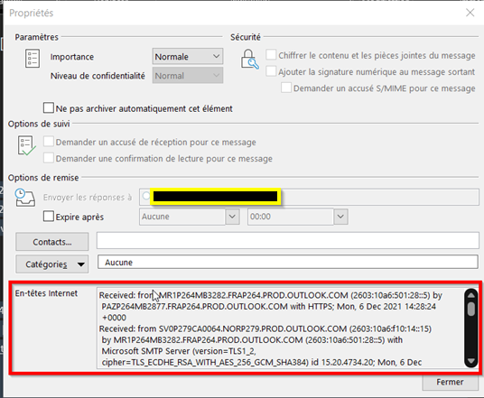
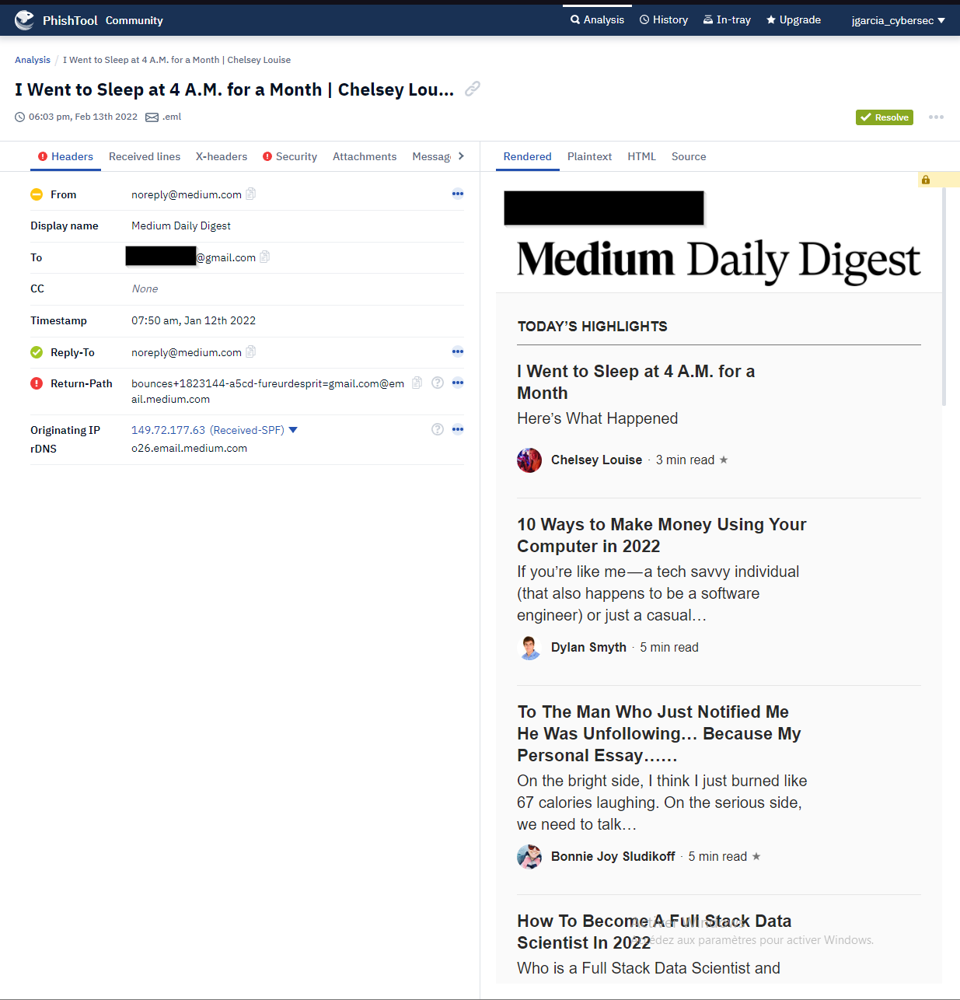
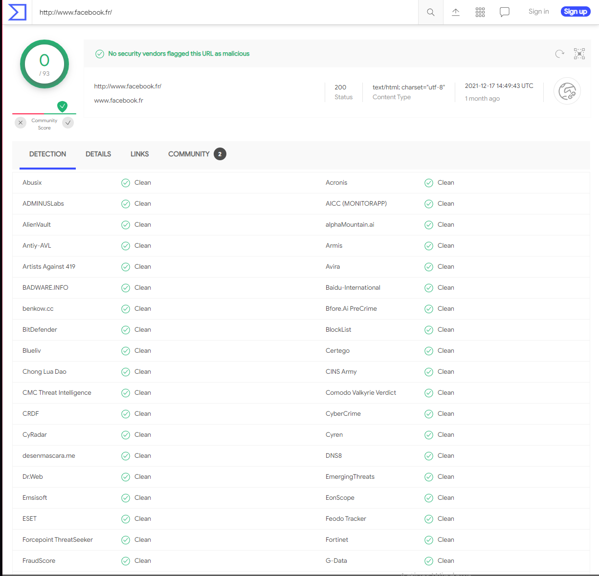
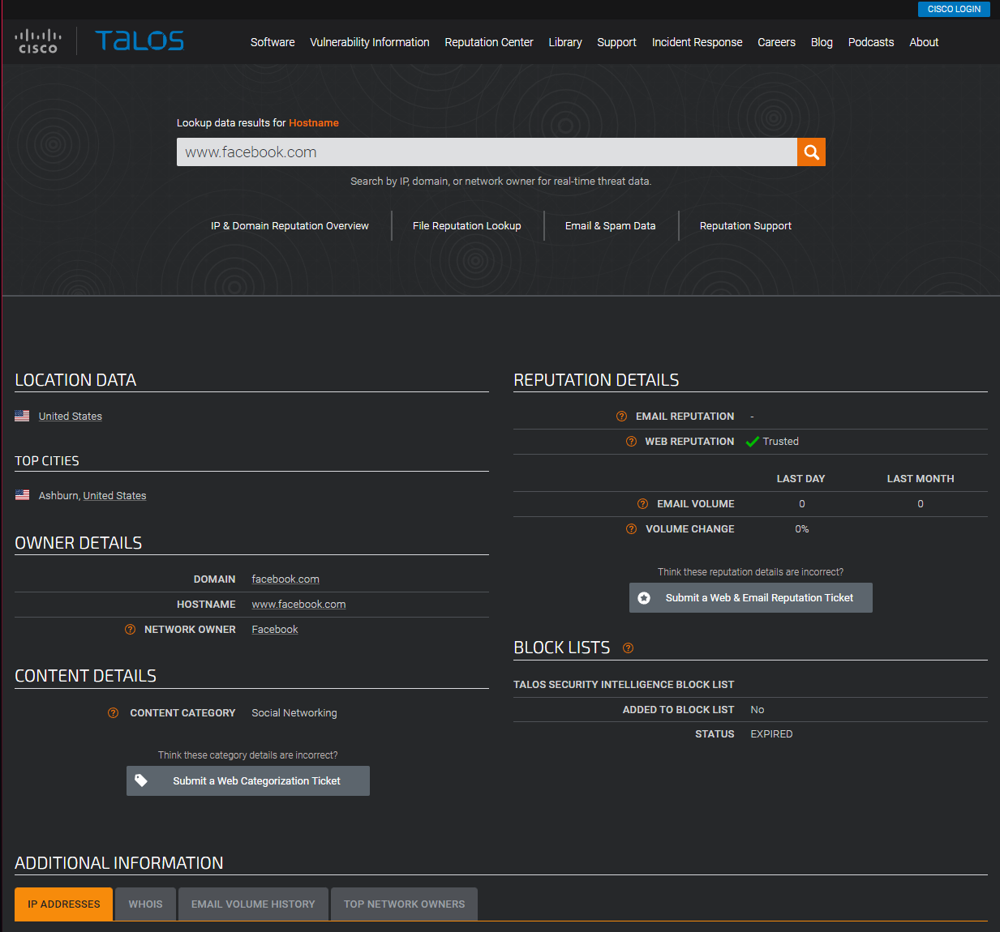
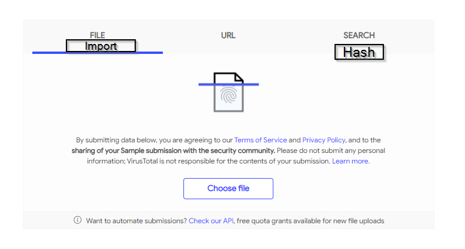
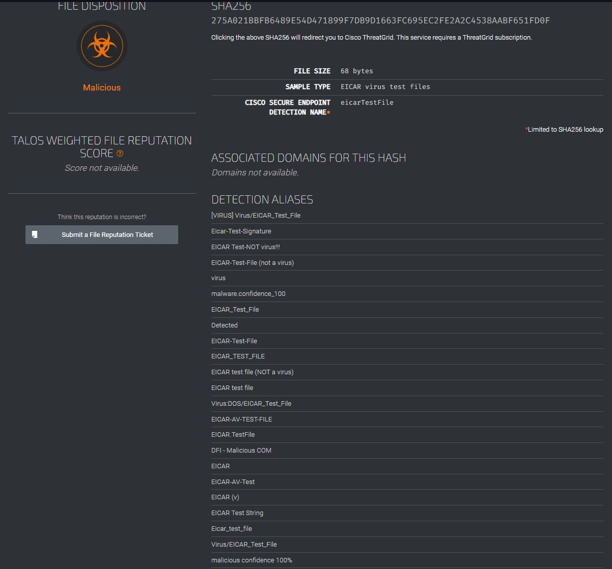
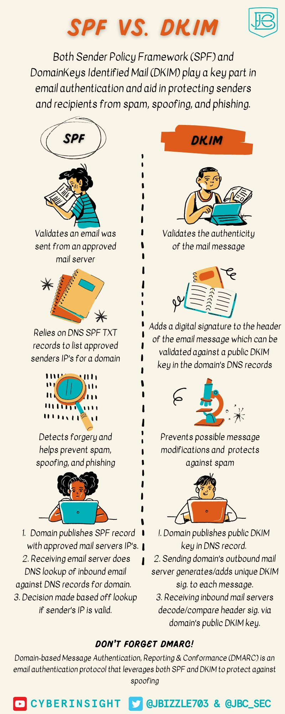

# Why fighting phishing is important?
In a phishing operation, more than 10% of all Internet users affected by such an attack click on a malicious link or open a dangerous attachment.
Globally, 57% of organizations have seen at least one successful phishing attack.
This technique is also in the top three access techniques for malicious actors.

# Why is blocking the sender not enough?
Blocking the sender once the email has been received is like installing a camera after a burglary.
That's good, but it doesn't tell the extent of the theft.

## Process Overview
The analysis and recommendation phases will be described below.
The diagram is available in the repo if needed.

# Prerequisites
In order to perform the analysis you will need a sandbox VM (Windows or Linux, with a network connection to the internet and capable of reading .msg and .eml files).
Ideally, the network used on this VM should be different from your production network.
You will also need the original emails to analyze.

# Analysis of the email code
## Get headers
To obtain the following information, you must open the file via a text editor such as notepad++, notepad or VS Code.

In some cases (for example with Office365), its information is to be obtained by opening the email then going to File > Property then copying the “internet headers” part into a text editor.

## Transmitter control

| Common name | Header name| Value |
| :---------------: | :---------------: | :---------------:
| Display Name |From|Medium Daily Digest |
| Sending email address |From| noreply[@]medium.com|
| Is the domain used that of a partner? |N/A| No|
| Reply to |Reply to (if not existing then same as sender)|noreply[@]medium.com |
| Subject |Subject|I Went to Sleep at 4 A.M. for a Month | Chelsey Louise |
| Issue Date |Date|Wed, 12 Jan 2022 06:50:00 +0000 (UTC) |
| Sending IP ||149.72.177.63 |
| DNS-Reverse of the sending IP|Make a Resolve-DNSName| o26.email.medium.com|
| Content Summary |N/A| Make here a summary of the mail (appearance similar to a third party service, quality of language, request, etc. |

## Attachements control and obfuscated code

| Common name | Header name| Value |
| :---------------: | :---------------: | :---------------:
| Presence of PJ |Yes / No | If yes, name and fingerprint sha256 |
| Content of the PJ ||Description of the content of the PJ|
| Content encoded? || If yes, coded version and decode. If the code is large, include a quick description |

> To get the hash on Windows: Get-FileHash -Algorithm SHA256 FICHER

## Control of the receipt of the mail

| Common name | Header name| Value |
| :---------------: | :---------------: | :---------------:
| SPF analysis | |Pass/Fail|
| DKIM Analysis | |Pass/Fail|
| DMARC scan ||Pass/Fail and configured policy|

> Un descriptif sur l'intêret de chacune de ces normes est disponible à la fin.

## Hyperlink control

| Common name | Header name| Value | Domain
| :---------------: | :---------------: | :---------------: | :---------------:
| Presence of URL |https| hxxps://URL.TLD/Page | Domain.TLD

> Be sure to replace "http" with hxxp so that the link is not clickable.

> Whois analysis can also identify malicious sites (a site created two days before receiving a malicious email is one more clue)

## Conclusion

At this point, we have enough information to define whether the email is malicious or not.

# What to do now that we know the email is malicious?
## Retrieve the email
The first thing is to repatriate the email, that is to say make it disappear from the mailbox of all people who have received it.

## To block !
We have enough information now to define whether or not to block the sender, the sending domain, the domains present in the URLs, etc.

## Identify other victims
Now that this email is "destroyed", it is necessary to check if other people of the Company are not victims of this attack.

The attacker may have sent an identical email to several personnel.
It is therefore necessary to look for any traces of identical activities (subject of mail, sender, name of PJ, link in the mail, etc.).

## The email had a link or an attachment ?
If the email had URLs, you must check in your tools (proxy servers, firewalls, etc.) whether posts have visited the URLs.
If the email had malicious attachments, you must check in your tools (EDR, antivirus, local logs) whether any workstations have executed these PJs.

> This is where a SIEM is welcome.

## Build your database
Once the research has been carried out, it is necessary to list in a database (even a simple csv file) all personnel who have been reached in this phishing campaign.

This database must contain the receiving email address, the existing rights on this BàL in delegations or transfers, the time of receipt, if the email has been read, if the PJ and/or the URLs have been contacted from this position.
In case of compromise, it will be necessary to turn off the analysis at all the accesses available for the station and the user concerned.

> If a potential compromise is detected, the IT security manager should be notified as soon as possible so that isolation measures can be taken during the additional investigation.

## Reassessment of corrective actions
Now that the analysis is done, it is time to reassess the measures taken.
In an emergency, certain measures can be taken and need to be questioned (example: blocking the domain only or setting up a lying DNS?).

# Feedback
Once the attack has been contained and depending on the scale, it may be interesting to carry out a RETEX to see the possible points of improvement (are the staff sufficiently trained? Was access to the mail servers ok? Are the query commands documented? etc.).

# Tools
To help you with the analysis, here are some useful tools.

## Automation of analysis
In order to save time and for small emails, you can go to [Phistool](https://app.phishtool.com). Just create a free account to submit your files.

## Website link
This section relates to the software allowing to analyze the URLs present in the mails.
### url2png
[URL2PNG](https://www.url2png.com) is a site that allows you to take a screen capture of a site by providing only the URL without having to risk the security of your computer.

### VirusTotal 
[VirtusTotal](https://www.virustotal.com/gui/home/url) is the part dedicated to URL analysis.
VirusTotal provides instant URL rating from nearly 100 anti-virus solutions.

> Be careful, just because a site is not listed as unreliable does not mean it is. A website set up a few days before the attack will not yet have been detected by antivirus solutions.

### Talos IP et and Domain Reputation Center
[This tool](https://talosintelligence.com/reputation_center) allows you to check the reliability of a site by checking the site's reputation with Talos (Cisco), location, whois, etc.

## Files
### VirusTotal
[VirusTotal](https://www.virustotal.com/gui/home/upload) allows you to test a file (via import or hash check).

### Talos File Réputation 
[Talos File Reputation](https://talosintelligence.com/talos_file_reputation) allows you to test a file by providing only the hash.

### Hybrid analysis
[This website](https://www.hybrid-analysis.com) s great, because it allows you to test sites as well as files (exe, pdf, etc.) or even hashes within a sandbox and generate YARA detection rules.

On the other hand, it is longer (sometimes 10 minutes for a pdf) but in the event of a new threat, a more reliable result is obtained.

[hybridAnalysis.png](./Images/hybridAnalysis.png)

# Report the email to the authorities

Now that the threat is eradicated, let's help the community avoid being fooled by this spam by reporting it on[CISA](https://www.cisa.gov/uscert/report-phishing).

# Approfondir le sujet

[The Weakest Link – User Security Awareness Game](https://www.isdecisions.com/user-security-awareness-game/)
[Online Phishing Quiz](https://phishingquiz.withgoogle.com/)
[A curated list of awesome social engineering resources](https://github.com/v2-dev/awesome-social-engineering)
[Phishing and Spear Phishing Wiki](https://www.peerlyst.com/posts/the-phishing-and-spearphishing-wiki-peerlyst)
[Anti-Phishing Working Group (AWPG) Phishing Resources](https://apwg.org/resources/)
[Phishing.org Phishing Resources](https://www.phishing.org/phishing-resources)
[GoPhish – Simulated Phishing Exercise Toolkit](https://getgophish.com/)
[SpearPhisher by TrustedSec – Simulated Phishing Exercise Toolkit](https://github.com/kevthehermit/SpearPhisher)
[Documentation antispam Microsoft](https://docs.microsoft.com/fr-fr/microsoft-365/security/office-365-security/anti-spam-message-headers?view=o365-worldwide) 

> Source: https://twitter.com/JBizzle703/status/1479209470114861057/photo/1