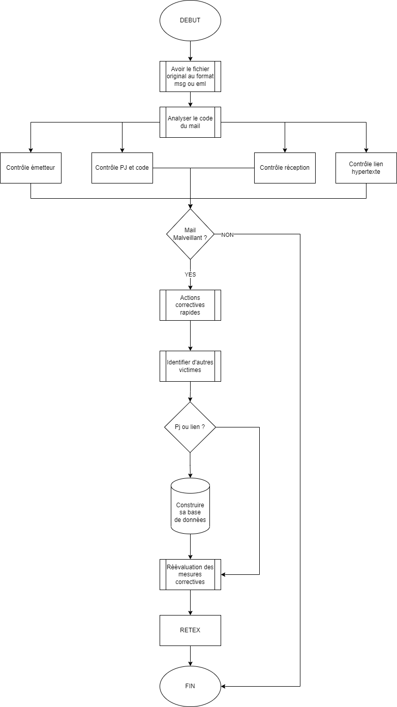
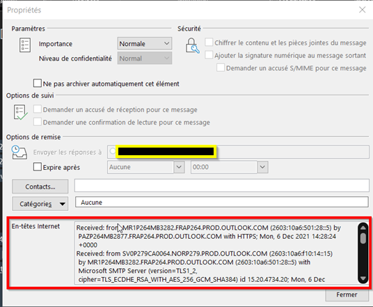
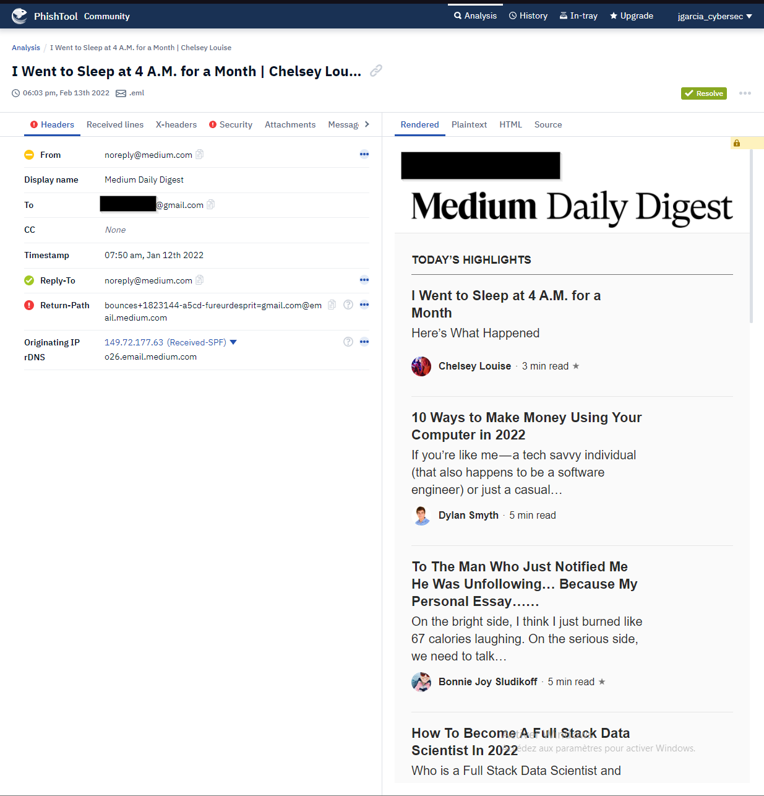
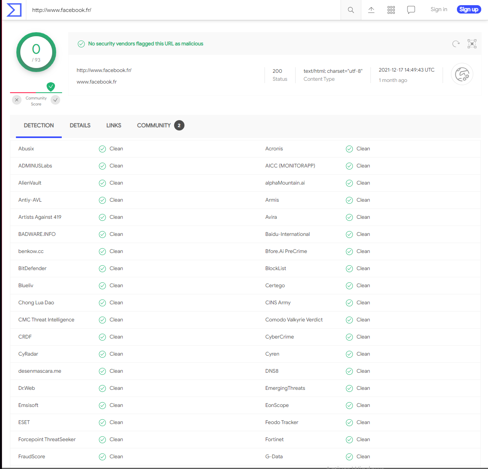
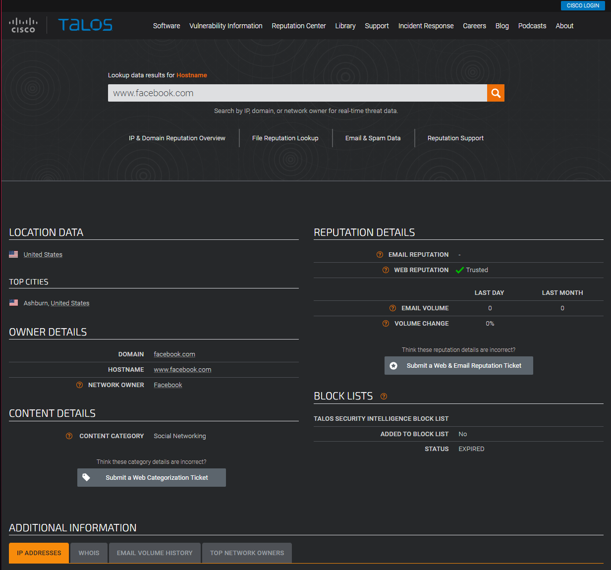
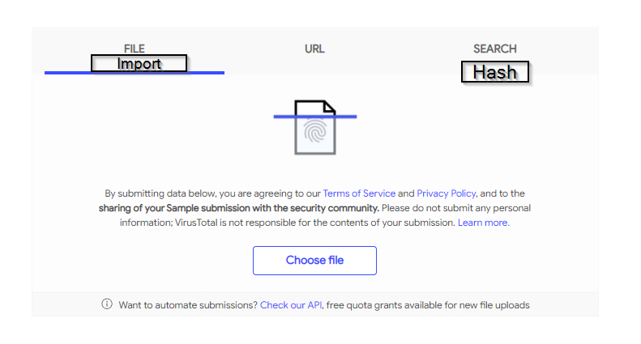
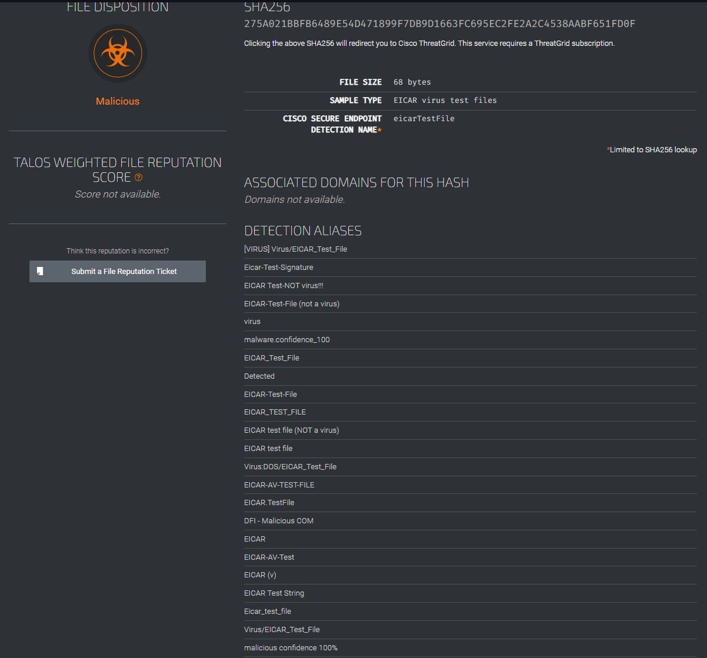
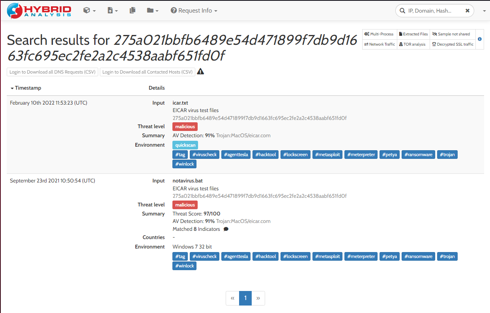
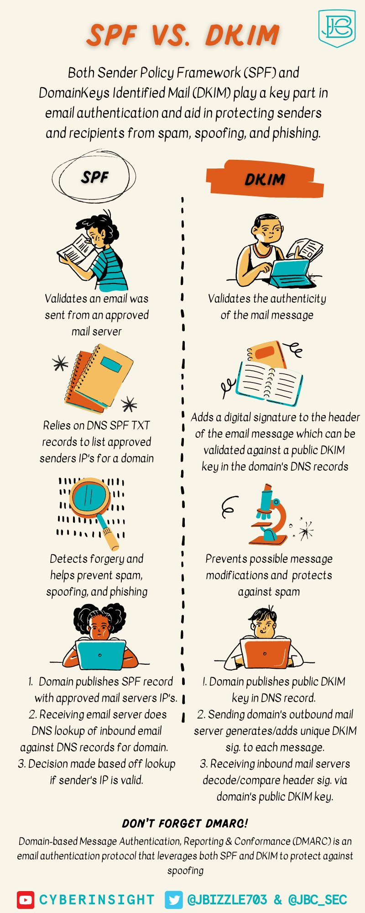

# Pourquoi lutter contre le phishing est important ?
Dans une opération de phishing, plus de 10 % de tous les internautes concernés par une telle attaque cliquent sur un lien malveillant ou ouvrent une pièce jointe dangereuse.
A l'échelle mondiale, 57 % des entreprises ont vu au moins une attaque phishing réussir.
Cette technique est aussi dans le top trois des techniques d'accès pour les acteurs malveillants.

# Pourquoi bloquer l'expediteur n'est pas suffisant ?
Bloquer l'expéditeur une fois le mail reçu revient à mettre une caméra après un cambriolage.
C'est bien, mais ça ne permet pas de savoir l'ampleur du vol.

## Présentation du processus

Les phases d'analyse et recommandations seront décrites plus bas.
Le diagramme est disponible dans le repo si besoin.

# Prerequis
Afin de réaliser l'analyse il vous faudra une VM bac à sable (Windows ou Linux, avec une connexion réseau vers internet et capable de lire les fichiers .msg et .eml).
Idéalement, le réseau utilisé sur cette VM doit être différent de votre réseau de production.
Il vous faudra aussi les mails originaux à analyser.

# Analyse du code du mail
## Obtenir les en-têtes
Pour obtenir les informations suivantes il faut ouvrir le fichier via un éditeur de texte comme notepad++, bloc-notes ou encore VS Code.

Dans certains cas (par exemple avec Office365), ses informations sont à obtenir en ouvrant le mail puis en allant dans Fichier > Propriété puis en copiant la partie « en-têtes internet » dans un éditeur de texte.

## Contrôle émetteur

| Nom usuel | Nom en-tête| Valeur |
| :---------------: | :---------------: | :---------------:
| Nom affiché |From|Medium Daily Digest |
| Adresse électronique émettrice |From| noreply[@]medium.com|
| Le domaine utilisé est-il celui d’un partenaire ? |N/A| Non|
| Répondre à |Reply to (si nexistant alors identique à expéditeur)|noreply[@]medium.com |
| Objet |Subject|I Went to Sleep at 4 A.M. for a Month | Chelsey Louise |
| Date d’émission |Date|Wed, 12 Jan 2022 06:50:00 +0000 (UTC) |
| IP émettrice ||149.72.177.63 |
| DNS-Reverse de l'IP émétrice|Faire un Resolve-DNSName| o26.email.medium.com|
| Résumé du contenu |N/A| Faire ici un résumé du mail (apparence similaire à un service tiers, qualité du language, demande, etc.|

## Contrôle PJ et code

| Nom usuel | Nom en-tête| Valeur |
| :---------------: | :---------------: | :---------------:
| Présence de PJ |Oui / Non | Si oui, nom et empreinte sha256 |
| Contenu de la PJ ||Description du contenu de la PJ|
| Contenu encodé ? || Si oui, version codé et décoder. Si le code est volumineux, incorporer une rapide description |

> Pour obtenir le hash sous Windows : Get-FileHash -Algorithm SHA256 FICHER

## Contrôle de la réception du mail

| Nom usuel | Nom en-tête| Valeur |
| :---------------: | :---------------: | :---------------:
| Analyse SPF |  |Pass / Fail|
| Analyse DKIM | |Pass / Fail|
| Analyse DMARC ||Pass / Fail et politique configurée|

> Un descriptif sur l'intérêt de chacune de ces normes est disponible à la fin.

## Contrôle du lien hypertexte

| Nom usuel | Nom en-tête| Valeur | Domain
| :---------------: | :---------------: | :---------------: | :---------------:
| Présence d’url |https| hxxps://URL.TLD/Page | Domain.TLD

> Bien remplacer "http" par hxxp afin que le lien ne soit pas cliquable.

> L'analyse du Whois peut aussi permettre d'identifier les sites malicieux (un site créer deux jours avants la réception d'un mail malicieux est un indice de plus)

## Conclusion

A ce stade, nous avons assez d'information pour définir sur le mail est malicieux ou non.

# Que faire maintenant qu'on sais que le mail est malicieux ?
## Rapatrier le mail
La première chose est de rapatrier le mail, c'est-à-dire le faire disparaitre de la boite mail de toutes personnes qui l'auraient reçu.

## Bloquer !
On a assez d'informations maintenant pour définir si l'on bloque ou non l'expéditeur, le domaine d'expédition, les domaines présents dans les URL, etc.

## Identifier d'autres victimes
Maintenant que ce mail est "détruit", il faut vérifier si d'autres personnes de l'Entreprise ne sont pas victime de cette attaque.

L'attaquant peut avoir envoyé un mail identique à plusieurs personnels.
Il faut donc rechercher toute traces d'activités identiques (objet de mail, expéditeur, nom de PJ, lien dans le mail, etc.).

## Le mail avais un lien ou une PJ ?
Si le mail avait des URLs il faut vérifier dans vos outils (serveurs mandataire, pare-feu, etc.) si des postes se sont rendus sur les URLs.
Si le mail avait des PJ malveillantes, il faut vérifier dans vos outils (EDR, antivirus, logs locaux) si des postes ont exécuté ces PJ.

> C'est là qu'un SIEM est le bienvenu.

## Construire sa base de données
Une fois la recherche effectuées il faut lister dans une base (même un simple fichier csv) tous personnels ayant été atteint dans cette campagne de phishing.

Cette base doit contenir l'adresse mail de réception, les droits existants sur cette BàL en délégations ou transferts, l'heure de réception, si le mail a été lu, si la PJ et/ou les URLs ont été contactées depuis ce poste.
En cas de compromission, il faudra éteindre l'analyse à tous les accès disponibles pour le poste et l'utilisateur concerné.

> En cas de détection de potentielle compromission, il convient d'avertir dans les plus brefs délais le responsable de la sécurité informatique pour que des mesures d'isolation puisse être prise le temps de l'investigation complémentaire.

## Réévaluation des mesures correctives
Maintenant que l'analyse est faite, il convient de réévaluer les mesures prises.
Dans l'urgence certaines mesures peuvent être prises et nécessités une remise en question (exemple : blocage du domaine uniquement ou mise en place d'un DNS menteur ?).

# RETEX
Une fois l'attaque contenue et suivant l'ampleur, il peut être intéressant de réaliser un RETEX pour voir les points d'améliorations possibles (est-ce que le personnel est assez formé ? Est-ce que les accès aux serveurs de messagerie était ok ? Est-ce que les commandes d'interrogations sont documentées ? etc.).

# Outils
Pour vous aider dans l'analyse, voici quelques outils utiles.

## Automatisation de l'analyse
Afin de gagner du temps et pour les mails de faibles importance vous pouvez vous rendre sur [Phistool](https://app.phishtool.com). Il suffit de créer un compte gratuitement pour soumettre vos fichiers.

## Lien web
Cette section porte sur les logiciels permettant d'analyser les URLs présentes dans les mails.
### url2png
[URL2PNG](https://www.url2png.com) est un site qui permet de réaliser une capture écran d'un site en fournissant uniquement l'URL sans avoir à risquer la sécurité de votre poste.

### VirusTotal 
[VirtusTotal](https://www.virustotal.com/gui/home/url) est la partie dédiée aux analyses d'URL.
VirusTotal permet d'avoir instantanément l'évaluation de l'URL auprès de presque 100 solutions antivirus.

> Attention, ce n'est pas parce qu'un site n'est pas répertorié comme non fiable que c'est le cas. Un site web monté quelques jours avant l'attaque n'aura pas encore été détecté par les solutions antivirus.

### Talos IP et and Domain Reputation Center
[Cet outil](https://talosintelligence.com/reputation_center) permet de contrôler la fiabilité d'un site en vérifiant la réputation du site auprès de Talos (Cisco), la localisation, le whois, etc.

## Fichier
### VirusTotal
[VirusTotal](https://www.virustotal.com/gui/home/upload) permet de tester un fichier (via import ou contrôle de hash).

### Talos File Réputation 
[Talos File Reputation](https://talosintelligence.com/talos_file_reputation) permet de tester un fichier en fournissant uniquement le hash.

### Hybrid analysis
[Ce site](https://www.hybrid-analysis.com) est génial, car il permet de tester aussi bien des sites que des fichiers (exe, pdf, etc.) ou encore des hashs au sein d'une sandbox et générer les règles YARA de détection.

C'est en revanche plus long (parfois 10 minutes pour un pdf) mais en cas de nouvelle menace, on obtient un résultat plus fiable.

# Signaler le mail auprès des autorités
Maintenant que la menace est éradiquée, allons aider la communauté à ne pas se faire avoir par ce spam en le signalant sur [Signal-Spam](https://www.signal-spam.fr).

# Approfondir le sujet

Retrouver l'article sur le blog : https://www.geekmunity.fr/?p=2327

[The Weakest Link – User Security Awareness Game](https://www.isdecisions.com/user-security-awareness-game/)
[Online Phishing Quiz](https://phishingquiz.withgoogle.com/)
[A curated list of awesome social engineering resources](https://github.com/v2-dev/awesome-social-engineering)
[Phishing and Spear Phishing Wiki](https://www.peerlyst.com/posts/the-phishing-and-spearphishing-wiki-peerlyst)
[Anti-Phishing Working Group (AWPG) Phishing Resources](https://apwg.org/resources/)
[Phishing.org Phishing Resources](https://www.phishing.org/phishing-resources)
[GoPhish – Simulated Phishing Exercise Toolkit](https://getgophish.com/)
[SpearPhisher by TrustedSec – Simulated Phishing Exercise Toolkit](https://github.com/kevthehermit/SpearPhisher)
[Documentation antispam Microsoft](https://docs.microsoft.com/fr-fr/microsoft-365/security/office-365-security/anti-spam-message-headers?view=o365-worldwide) 

> Source: https://twitter.com/JBizzle703/status/1479209470114861057/photo/1
